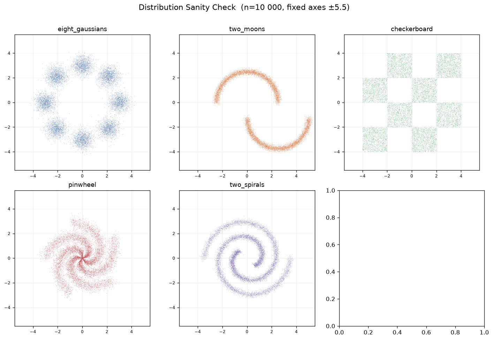
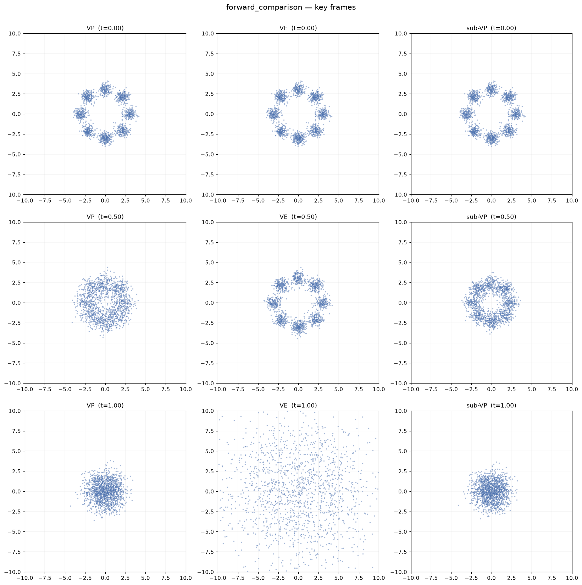
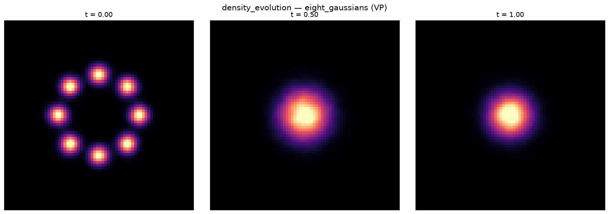
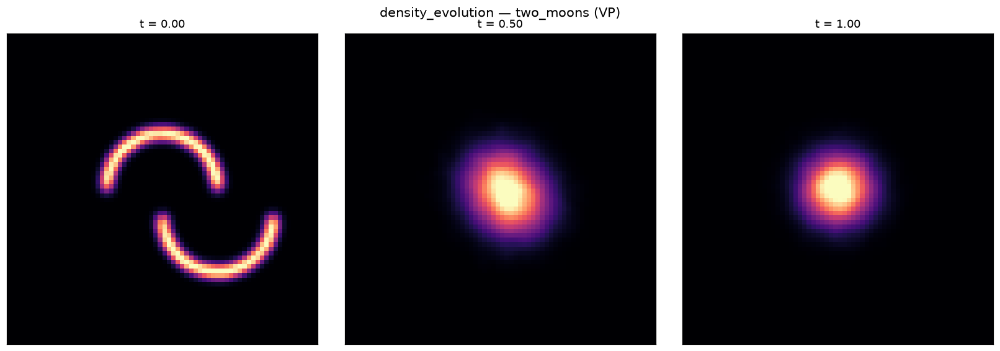
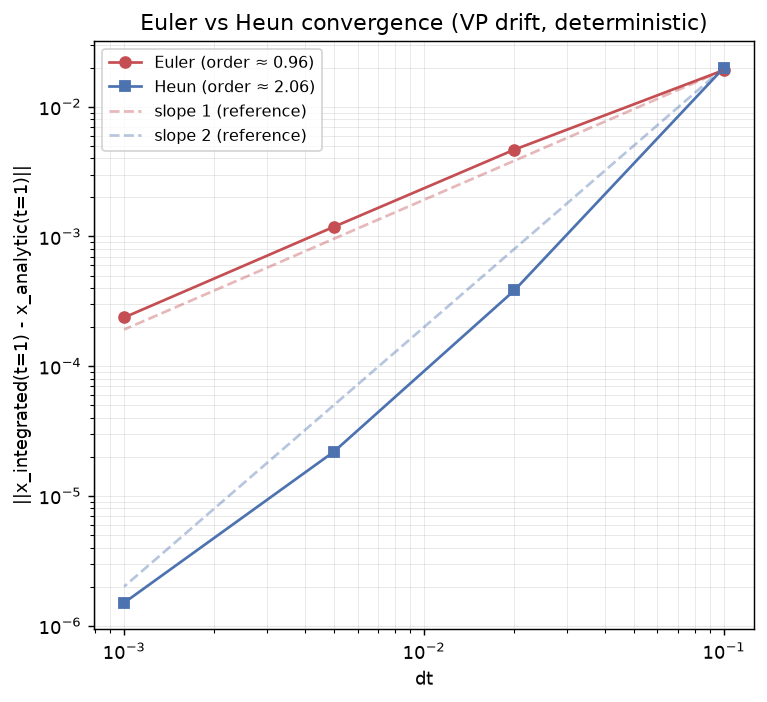
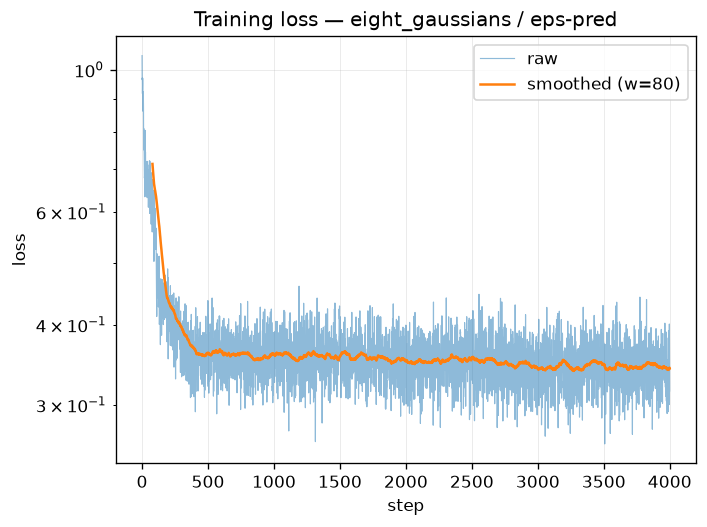
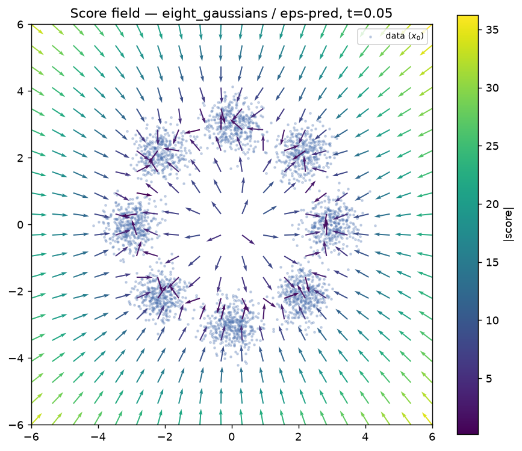
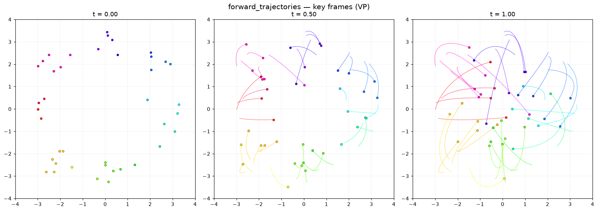
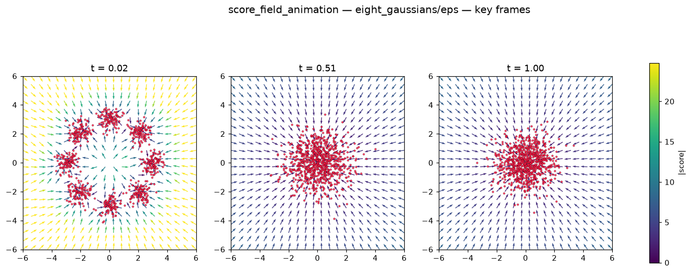

# Documentación Técnica — Lab 3: Visualizador de Procesos Generativos en 2D

Ver también [`docs/theory.md`](theory.md) para el trasfondo conceptual y
[`references/NOTES.md`](../references/NOTES.md) para las ecuaciones y citas
exactas de cada componente.

---

## 1. Estructura del proyecto

```
lab3-generative-2d/
├── references/         # Ecuaciones + citas (NOTES.md)
├── docs/                # Este documento y teoría
├── configs/             # Hydra configs por componente (pendiente de uso)
├── src/
│   ├── data/            # Distribuciones sintéticas 2D + registry
│   ├── forward_process/ # VP/VE/subVP SDE + kernels cerrados
│   ├── models/          # (pendiente)
│   ├── training/        # (pendiente)
│   ├── sampling/        # (pendiente)
│   ├── integrators/     # (pendiente)
│   └── viz/             # Animaciones (forward_comparison, density_evolution)
├── scripts/             # Scripts de validación y sanity checks
├── outputs/
│   ├── sanity_checks/   # Plots, tablas y keyframes generados
│   └── videos/          # mp4s de las animaciones
└── checkpoints/         # (pendiente)
```

---

## 2. Distribuciones sintéticas (`src/data/`) — Paso 1

### Interfaz

Cada distribución es una función con la firma:

```python
def dist_fn(n: int, seed: int = 0) -> np.ndarray:  # shape (n, 2)
```

Registradas en [`src/data/registry.py`](../src/data/registry.py) bajo un
diccionario `REGISTRY: dict[str, callable]`, para selección por nombre sin
tocar código (`get_distribution(name)`).

| Nombre | Función | Descripción |
|---|---|---|
| `eight_gaussians` | `src/data/distributions.py::eight_gaussians` | 8 modos gaussianos isotrópicos en círculo de radio 3, σ=0.4 |
| `two_moons` | `src/data/distributions.py::two_moons` | Dos arcos semicirculares, ruido σ=0.05, escalado ×2.5 |
| `checkerboard` | `src/data/distributions.py::checkerboard` | Rejilla 4×4 en $[-4,4]^2$, celdas alternas activas (rejection sampling, sin ruido) |
| `pinwheel` | `src/data/distributions.py::pinwheel` | 5 brazos espirales, ruido radial σ=0.25 y angular σ=0.04 rad |
| `two_spirals` | `src/data/distributions.py::two_spirals` | 2 espirales de Arquímedes entrelazadas, 1.5 vueltas cada una |

### Sanity check visual

Script: [`scripts/check_distributions.py`](../scripts/check_distributions.py).
Genera `n=10 000` muestras por distribución, con ejes fijos en
$[-5.5, 5.5]^2$ para comparabilidad directa entre distribuciones.



**Estadísticas (media ± std por eje, n=10 000, seed=42):**

```
eight_gaussians   x: +0.002 ± 2.158  y: +0.040 ± 2.157  |max|: 4.28
two_moons         x: +1.265 ± 2.156  y: -0.626 ± 2.351  |max|: 5.36
checkerboard      x: +0.010 ± 2.306  y: +0.000 ± 2.329  |max|: 4.00
pinwheel          x: -0.005 ± 1.277  y: +0.002 ± 1.266  |max|: 3.63
two_spirals       x: +0.011 ± 1.667  y: -0.035 ± 1.612  |max|: 3.86
```

Confirmado visualmente (aprobado por el usuario): Two Moons con separación
clara entre arcos, Checkerboard con celdas discretas bien alineadas sin
fragmentación, modos de Eight Gaussians claramente distinguibles, y sin
diferencias de escala absurdas entre distribuciones (rango de |max| entre
3.6 y 5.4).

---

## 3. Procesos forward (`src/forward_process/`) — Paso 2

### Interfaz común

[`src/forward_process/base.py`](../src/forward_process/base.py) define la
clase abstracta `ForwardProcess`:

```python
class ForwardProcess(ABC):
    def drift(self, x: Tensor, t: Tensor) -> Tensor: ...
    def diffusion(self, t: Tensor) -> Tensor: ...
    def marginal_prob(self, x0: Tensor, t: Tensor) -> tuple[Tensor, Tensor]: ...
```

`marginal_prob` devuelve `(mean, std)` del kernel cerrado
$q(\mathbf{x}_t\mid\mathbf{x}_0)=\mathcal{N}(\text{mean}, \text{std}^2 I)$,
con `std` ya remodelado para hacer broadcast contra `x0`.

### Implementaciones

| Clase | Archivo | Ecuación (NOTES.md) |
|---|---|---|
| `VPSDE` | [`vp_sde.py`](../src/forward_process/vp_sde.py) | §1 (drift/diffusion), §4 (kernel) |
| `VESDE` | [`ve_sde.py`](../src/forward_process/ve_sde.py) | §2 (drift/diffusion), §4 (kernel) |
| `SubVPSDE` | [`subvp_sde.py`](../src/forward_process/subvp_sde.py) | §3 (drift/diffusion), §3-update (kernel derivado) |

Utilidades compartidas: `schedules.py` (β lineal, integral de β para VP y
sub-VP), `kernels.py` (funciones puras `vp_transition_kernel`,
`ve_transition_kernel`, `subvp_transition_kernel`).

**Nota sobre el kernel de sub-VP**: no está transcrito de un número de
ecuación de NOTES.md — se derivó analíticamente (isometría de Itô sobre la
solución general de SDEs lineales) porque NOTES.md §4 solo documentaba los
kernels de VP y VE citando el paper. La derivación completa está en el
docstring de `kernels.py` y el resultado es
$\sigma_t = 1-\alpha(t)^2$ (con $\alpha(t)$ igual al del VP), validado
numéricamente más abajo. Pendiente: contrastar contra Song et al. 2021,
Appendix B.

---

## Validación numérica del kernel cerrado (Paso 2)

Script: [`scripts/validate_forward_process.py`](../scripts/validate_forward_process.py).

**Método**: para $\mathbf{x}_0=(2.5,-1.8)$ fijo y $t\in\{0.1,0.3,0.5,0.7,0.9\}$,
se generan $N=50\,000$ muestras $\mathbf{x}_t=\mu_t+\sigma_t\cdot\varepsilon$
directamente desde `marginal_prob()` (sin integrar la SDE paso a paso), y se
compara la media/std empírica contra $(\mu_t,\sigma_t)$ analíticos.

**Nota de alcance**: esta prueba valida que la implementación (shapes,
broadcasting, aritmética de `marginal_prob` + reparametrización) es
internamente consistente — no re-deriva la solución de la SDE por
integración numérica independiente (Euler-Maruyama), lo cual queda para un
paso posterior de validación del solver.

**Hallazgo durante la validación**: con la métrica ingenua
`err_mean = ‖emp_mean - pred_mean‖ / ‖pred_mean‖`, dos casos (`VP t=0.9`,
`subVP t=0.9`) superaban el umbral de 2% (20.7% y 7.2% respectivamente),
mientras que `err_std` se mantenía por debajo de 0.5% en los 15 casos. Se
diagnosticó la causa: en $t=0.9$, $\alpha(t)\approx 0.017$, por lo que
$\|\mu_t\| \approx 0.052$ es del mismo orden que el error estándar esperado
de la media empírica ($\text{std}/\sqrt{N}\approx 0.0063$) — dividir por una
media que se acerca a cero por diseño (el proceso borra la señal) infla el
error relativo aunque la implementación sea correcta. Se corrigió
normalizando por $\|\mathbf{x}_0\|$ (escala fija, nunca cero) en vez de por
$\|\mu_t\|$. Con esta corrección los 15 casos pasan.

### Tabla de resultados (N=50 000, seed=123)

```
process      t   pred_std  err_mean/||mean||  err_mean/||x0||   err_std   status
--------------------------------------------------------------------------------
VP         0.1     0.3221             0.138%           0.131%    0.323%       OK
VP         0.3     0.7770             0.048%           0.030%    0.282%       OK
VP         0.5     0.9597             0.658%           0.185%    0.153%       OK
VP         0.7     0.9964             0.212%           0.018%    0.062%       OK
VP         0.9     0.9999            20.727%           0.352%    0.064%       OK
VE         0.1     0.0212             0.003%           0.003%    0.071%       OK
VE         0.3     0.1283             0.029%           0.029%    0.218%       OK
VE         0.5     0.7070             0.068%           0.068%    0.323%       OK
VE         0.7     3.8840             0.907%           0.907%    0.219%       OK
VE         0.9    21.3340             1.466%           1.466%    0.491%       OK
subVP      0.1     0.1037             0.025%           0.024%    0.704%       OK
subVP      0.3     0.6037             0.122%           0.077%    0.130%       OK
subVP      0.5     0.9209             0.491%           0.138%    0.098%       OK
subVP      0.7     0.9929             1.950%           0.164%    0.440%       OK
subVP      0.9     0.9997             7.181%           0.122%    0.200%       OK
```

15/15 combinaciones (proceso, t) pasan con `err_mean/||x0||` y `err_std`
ambos ≤ 2%. Tabla persistida en
[`outputs/sanity_checks/forward_process_validation.txt`](../outputs/sanity_checks/forward_process_validation.txt).

**Observación adicional confirmada por la tabla**: `pred_std` de `subVP` es
consistentemente menor que el de `VP` para el mismo $t$ (p. ej. t=0.5:
0.921 vs 0.960; t=0.1: 0.104 vs 0.322) — consistente con la propiedad
"sub-variance" descrita en la teoría.

---

## 4. Animaciones (`src/viz/`) — Paso 3

Ambos scripts usan el kernel cerrado validado en el paso 2
(`marginal_prob`), no integración paso a paso de la SDE. Para que las
trayectorias se vean continuas en vez de parpadear (ruido independiente en
cada frame), cada partícula recibe un vector de ruido estándar $z$ **fijo**,
reutilizado en todos los frames y procesos:

$$
\mathbf{x}_t(z) = \mu_t(\mathbf{x}_0) + \sigma_t \cdot z, \qquad z \sim \mathcal{N}(0, I) \text{ (fijo por partícula)}
$$

Como $z$ es normal estándar, $\mathbf{x}_t(z)$ tiene exactamente la
distribución marginal que predice `marginal_prob` en cada $t$ — no es una
trayectoria literal de un camino de Wiener, pero sí una forma válida y
estándar de visualizar la evolución marginal sin parpadeo.

### Animación 1 — `forward_comparison.py`

Compara VP / VE / sub-VP lado a lado sobre las mismas 1500 muestras de
`eight_gaussians` (misma seed=7), con ejes idénticos en los tres subplots.

**Ajuste de escala reportado**: el `sigma_max` validado de VE en el paso 2
es 50 — usarlo aquí exigiría un eje compartido de radio ~±150 para
contener a VE en t=1, dejando a VP/sub-VP reducidos a un punto invisible.
Para esta visualización lado a lado (solo aquí, el default validado de
`VESDE` no se tocó en el resto del código) se instanció
`VESDE(sigma_max=4.0)`. El límite de los ejes se calculó automáticamente
como el percentil 99.5 de `|coordenada|` sobre todos los procesos/frames,
con margen del 15% y redondeo hacia arriba al múltiplo de 5 más cercano,
dando **±10** para esta combinación de distribución/seed.



**Verificación**:
- t=0: los tres subplots son idénticos (misma muestra, mismo z, t=0 ⟹ mean=x0, std=0 en los tres).
- t=0.5: VP y sub-VP ya colapsaron a un blob compacto cerca del origen; VE aún distingue los 8 modos (con algo más de dispersión que en t=0).
- t=1: VP y sub-VP son gaussianas compactas cerca del origen (std≈1); VE ocupa el marco completo ±10, consistente con "variance exploding". Sin clipping — todo el rango observado cabe dentro de los ejes.

Video: [`outputs/videos/forward_comparison.mp4`](../outputs/videos/forward_comparison.mp4)

### Animación 2 — `density_evolution.py`

Densidad (histograma 2D + suavizado gaussiano ligero, σ=1 bin) de 30 000
partículas bajo el proceso VP, para `eight_gaussians` (multimodal) y
`two_moons` (soporte curvo). Eje fijo en ±7 (VP se mantiene acotado:
std≤1, dispersión de x0 ~2–2.5, por lo que ±7 no recorta nada). Cada frame
normaliza su propio color (percentil 99.5 del frame) para que la *forma*
siga siendo legible aunque la densidad real se aplane con t — la
intensidad de color no es comparable entre frames, solo la forma.





**Verificación**:
- `eight_gaussians`: 8 picos nítidos en t=0 → un único blob compacto ya en t=0.5 → prácticamente igual en t=1 (esperado: con β_max=20 el VP colapsa rápido, std(0.5)=0.96 vs std(1)=0.9999, casi idénticos — consistente con la tabla de validación del paso 2).
- `two_moons`: forma de dos arcos curvos en t=0 → un único blob compacto en t=0.5 y t=1.
- Colapso monótono en ambos casos, sin picos espurios que aparezcan/desaparezcan entre frames — esperado dado que el mismo $z$ por partícula garantiza una evolución continua de la densidad agregada.

Videos: [`density_evolution_eight_gaussians.mp4`](../outputs/videos/density_evolution_eight_gaussians.mp4), [`density_evolution_two_moons.mp4`](../outputs/videos/density_evolution_two_moons.mp4)

---

## 5. Integradores numéricos (`src/integrators/`) — Paso 4

Tres funciones puras en [`steps.py`](../src/integrators/steps.py), agnósticas
al proceso que integran (solo reciben `drift_fn(x,t)` y, para el paso
estocástico, `diffusion_fn(t)`):

| Función | Orden | Tipo |
|---|---|---|
| `euler_step` | 1 | determinista |
| `heun_step` | 2 (predictor-corrector) | determinista |
| `euler_maruyama_step` | fuerte 0.5 / débil 1 | estocástico |

### Validación — `scripts/validate_integrators.py`

**Parte 1 — Euler vs Heun (drift puro del VP)**: la ODE $dx/dt=f(x,t)$ sin
ruido tiene solución exacta $x(t)=\alpha(t)x_0$ (el drift del VP es lineal),
que coincide exactamente con la media de `marginal_prob` — no es una
aproximación, es el target analítico exacto. Se integró desde $x_0=(2.5,-1.8)$
hasta $t=1$ con $N\in\{10,50,200,1000\}$ pasos.

```
     N        dt   err_euler_abs   err_euler_rel    err_heun_abs    err_heun_rel
--------------------------------------------------------------------------------
    10    0.1000        0.019181          0.623%        0.020031          0.650%
    50    0.0200        0.004669          0.152%        0.000384          0.012%
   200    0.0050        0.001186          0.039%        0.000022          0.001%
  1000    0.0010        0.000237          0.008%        0.000002          0.000%

Orden ajustado (pendiente log-log) — Euler: 0.96 (esperado ≈1)
Orden ajustado (pendiente log-log) — Heun:  2.06 (esperado ≈2)
```



Heun sigue la línea de referencia de pendiente 2 y Euler la de pendiente 1
en todo el rango de $dt$ — confirma el orden de convergencia esperado.

**Parte 2 — Euler-Maruyama (SDE completa)**: 10 000 trayectorias independientes,
1000 pasos ($dt=0.001$), desde el mismo $x_0$, bajo VP completo (drift +
diffusion).

```
emp_var:   [1.0370, 1.0048]
true_var:  [0.9999568, 0.9999568]
err_var_rel: ['3.703%', '0.488%']   (umbral: 5%)
```

Nota metodológica aplicada: aquí la varianza analítica en $t=1$ es
$\approx 1$ (no se acerca a cero), así que normalizar contra ella misma es
seguro — a diferencia del caso de la media del paso 2, donde hubo que
normalizar contra $\|\mathbf{x}_0\|$ porque la media sí se anula por diseño.
El error de 3.7% en el primer componente es consistente con el ruido de
Monte Carlo esperado (error estándar relativo de la varianza con N=10 000
$\approx\sqrt{2/N}\approx 1.4\%$, más sesgo de discretización de Euler-Maruyama
de orden $O(dt)$) — dentro del umbral de 5%.

**Resultado**: ambas partes de la validación pasan — orden de Heun (2.06) >
orden de Euler (0.96); error de varianza (3.70%) ≤ 5%.

---

## 6. Modelo de denoising y training (`src/models/`, `src/training/`) — Paso 5a

### Arquitectura

[`src/models/denoiser.py`](../src/models/denoiser.py):

- `Denoiser`: MLP (4 capas, hidden_dim=128, SiLU) con embedding temporal
  sinusoidal (dim=32) concatenado a `x`. Agnóstico a la parametrización —
  el mismo output crudo se interpreta como ε o v según cómo se entrenó.
- `DenoiserWrapper(model, forward_process, param)`: convierte la salida
  cruda a score usando las fórmulas exactas de NOTES.md:
  - `epsilon_to_score` — NOTES.md §5: $\text{score}=-\varepsilon_\theta/\sigma_t$
  - `v_to_score` — NOTES.md §6: $\text{score}=-(\alpha(t)v_\theta+\sigma_t x_t)/\sigma_t^2$
  - $\alpha(t)$ y $\sigma_t$ se obtienen de `forward_process.marginal_prob(ones_like(x), t)`
    (con $x_0=\mathbf{1}$, la media devuelta es $\alpha(t)$ directamente,
    evitando dividir por un $x_0$ que podría ser cero).
  - **Nota de compatibilidad**: ε/v-prediction están definidas sobre el
    kernel estilo VP ($\text{mean}=\alpha(t)x_0$, $\text{std}=\sigma_t$,
    NOTES.md §4) — por eso el pipeline de entrenamiento usa `VPSDE`
    exclusivamente, no VE ni sub-VP.
- `device = torch.device("cuda" if torch.cuda.is_available() else "cpu")`
  en ambos `denoiser.py`-dependent scripts (`train_score.py`,
  `validate_score_field.py`) — mismo código correrá sin cambios en Colab.

### Training loop

[`src/training/train_score.py`](../src/training/train_score.py): loss de
denoising score matching estándar (NOTES.md §5 para el objetivo simplificado
de ε; target de v construido como $v=\alpha(t)\varepsilon-\sigma_t x_0$,
NOTES.md §6). CLI: `--distribution`, `--param {eps,v}`, `--steps`/`--epochs`,
`--seed`, etc. Guarda checkpoint en `checkpoints/{distribucion}_{param}_seed{seed}.pt`,
log de loss en `.csv`, y curva de loss en PNG.

### Corrida de prueba (paso 5a, solo validación de pipeline — CPU local)

`eight_gaussians`, ε-pred, seed=0, 3000 pasos, batch=256:



La loss baja de ~0.94 a ~0.35 en los primeros ~300 pasos y se estabiliza
(no se buscó convergencia total, solo confirmar que el pipeline aprende).

### Validación cualitativa del campo de score — `scripts/validate_score_field.py`

Score evaluado en $t=0.05$ sobre una grilla, usando el checkpoint de arriba:



**Verificación**: el campo apunta consistentemente hacia el modo gaussiano
más cercano en cada región del plano — no hacia el origen, no en
direcciones erráticas. La magnitud crece con la distancia al modo más
cercano, coherente con una densidad casi puntual en $t$ pequeño. Confirma
que la conversión ε→score y la construcción del target de entrenamiento
son correctas.

**Pendiente explícito para el paso 5b (Colab/GPU)**: entrenar el resto de
distribuciones y la parametrización v-pred — no se hizo aquí, según lo
acordado.

**Actualización — paso 5b completado**: los 8 checkpoints (4 distribuciones ×
{eps, v}, 30 000 pasos, batch 512, lr 1e-3, seed 0) se entrenaron en Colab
(GPU T4) y están en `checkpoints/`.

---

## 7. Animaciones 3 y 4 (`src/viz/`) — Paso 6

### Animación 3 — `forward_trajectories.py`

40 partículas de `eight_gaussians`, proceso VP, mismo truco de $z$ fijo por
partícula que las animaciones anteriores. Cada trayectoria se dibuja como
una línea que **crece** con los frames (no solo la posición actual),
manteniendo visible el recorrido completo.



**Verificación**: en t=0 las 40 partículas están en sus posiciones
originales (8 modos reconocibles); en t=0.5 las trayectorias ya muestran
curvas sustanciales hacia el centro; en t=1 las líneas se enredan en una
maraña centrada en el origen — consistente con el colapso rápido del VP ya
observado en el paso 3 (density_evolution). Eje ±4, sin clipping.

Video: [`outputs/videos/forward_trajectories.mp4`](../outputs/videos/forward_trajectories.mp4)

### Animación 4 — `score_field_animation.py`

Carga un checkpoint entrenado (`eight_gaussians_eps_seed0.pt` por defecto),
evalúa el score aprendido (vía `DenoiserWrapper`) sobre una grilla espacial
fija en cada $t\in[0.02,1]$, superponiendo 800 partículas reales del
proceso forward (mismo truco de $z$ fijo).



**Verificación pedida — resultado**:
- **t≈0**: el campo está claramente estructurado alrededor de los 8 modos, con magnitud grande lejos de los datos (amarillo) y pequeña cerca de cada modo (morado oscuro) — coherente con una densidad casi puntual.
- **t≈0.5 y t≈1**: el campo ya es un patrón radial casi uniforme apuntando hacia el origen en ambos casos, prácticamente indistinguibles entre sí.

**Nota importante (no es un bug)**: que t=0.51 y t=1.00 se vean casi
idénticos —ambos ya colapsados— es consecuencia directa del schedule VP
usado ($\beta_{\max}=20$), que ya vimos en el paso 3 que colapsa la
estructura multimodal muy rápido (para t≈0.5, $\text{std}(0.5)\approx0.96$
vs $\text{std}(1)\approx0.9999$, casi iguales). Esto es una característica
real del forward process configurado, no una limitación del modelo ni un
error de la conversión score — vale la pena mencionarlo en el informe como
motivación para explorar un schedule con colapso más gradual (p. ej.
$\beta_{\max}$ menor) si se quiere ilustrar mejor la transición intermedia.

Video: [`outputs/videos/score_field.mp4`](../outputs/videos/score_field.mp4)

---

## 8. Revisión post-hoc y correcciones (paso 6, tras feedback directo del usuario)

El usuario pidió una revisión honesta de los resultados y señaló 3 problemas
reales, verificados extrayendo **frames reales de los mp4** (no solo los
keyframes precalculados, para descartar que el bug estuviera solo en el
script de keyframes y no en la animación real):

1. **`forward_comparison` "no se mueve"**: confirmado parcialmente — sí
   anima, pero con `beta_max=20` (default validado), VP y sub-VP terminan el
   100% de su colapso visible dentro del primer ~25% del video (t<0.3) y el
   ~75% restante muestra un blob prácticamente estático. Causa: nunca
   apliqué a VP/sub-VP la misma lógica de ajuste de escala para
   visualización que ya había aplicado a VE (`VE_SIGMA_MAX`). **Fix**:
   `BETA_MAX_COMPARE=4.0` para VP y sub-VP en esta animación (mismo
   principio, ya documentado, que `VE_SIGMA_MAX`). Beneficio adicional no
   anticipado: con el colapso más gradual, ahora se distingue visualmente
   sub-VP de VP en t=0.5 (antes ambos ya colapsaban idénticos, ocultando la
   diferencia real de varianza entre ambos procesos).

2. **Color de partículas en `score_field_animation` no distinguible**:
   confirmado, bug real de diseño — puntos blancos con borde negro delgado
   sobre fondo blanco y quiver viridis (oscuro cerca de los datos) eran casi
   invisibles. **Fix**: color sólido `#FF1744` (carmesí), tamaño y alpha
   aumentados — color ausente en la paleta viridis, por lo que se lee bien
   contra cualquier región del campo.

3. **`forward_trajectories` no se reconoce como la distribución original**:
   confirmado — 40 partículas coloreadas con HSV independiente por índice
   (arcoíris) impedían agrupar visualmente los 8 modos; se veían 40 puntos
   de colores aleatorios, no 8 clusters. **Fix**: color por ángulo de cada
   punto $x_0$ respecto al centroide de los datos, de forma que partículas
   del mismo modo comparten tono similar. También se le aplicó el mismo fix
   de pacing (`BETA_MAX_TRAJ=4.0`) por la misma razón que en (1).
   `density_evolution` se verificó con frames reales del mp4 y **no**
   presentaba este problema (eight_gaussians y two_moons se reconocen
   correctamente en t=0).

**Sobre usar Manim (3blue1brown) en vez de matplotlib**: se evaluó y se
descartó. Manim está diseñado para animación matemática declarativa
(ecuaciones, pruebas geométricas) donde cada elemento es un Mobject
vectorial individual — con 1500-30 000 partículas por frame (como en
`forward_comparison` o `density_evolution`), sería dramáticamente más lento
que el dibujo vectorizado de matplotlib (blitting de arrays completos).
Tampoco tiene soporte nativo para quiver fields calculados desde tensores
de PyTorch. matplotlib.animation + ffmpeg es la herramienta estándar para
este tipo de visualización científica numérica; los problemas reportados
eran bugs de diseño (color, escala de parámetros para pacing), no una
limitación de la librería usada.

---

## 9. Revisión de código (pasos 7+) y re-entrenamiento — auditoría de "¿esto es SOTA?"

### 9.1 Hallazgos de código corregidos

1. **Cita rota** (`src/sampling/utils.py`): `reverse_sde_forward_drift` citaba "NOTES.md sección 7" para la SDE reversa estocástica, pero esa sección solo documentaba la Probability Flow ODE. Se agregó la subsección "SDE reversa" a NOTES.md §7 con la fórmula completa (Anderson 1982 / Song et al. 2021 Eq. 6) y se corrigió la cita en el código.
2. **Clutter visual en `reverse_sde_generation.py`**: dibujar el historial completo de 60 trayectorias estocásticas (caminatas aleatorias jagged) enterraba la estructura final de 8 clusters en ruido de líneas — confirmado comparando contra `pf_ode_generation` (determinista, limpio) y `sampler_comparison` (mismo checkpoint, resultado correcto). Fix: ventana de cola (`trail_length=25`, comet-tail) en vez de historial completo, más marcadores finales grandes y opacos con `zorder` alto.
3. **Duplicación** entre `train_score.py` y `train_flow_matching.py`: ~40 líneas de guardado de checkpoint/CSV/plot de loss extraídas a `src/training/common.py::save_checkpoint_and_plot`.

### 9.2 Re-entrenamiento local (sin Colab) — validación del argumento "es barato"

Dado que el paso 2 del cálculo de Bayes (ver más abajo) y la evidencia de pasos anteriores mostraban que la loss se estanca dentro del primer 5-10% de los 30 000 pasos usados en Colab, se re-entrenaron los 12 modelos (4 distribuciones × {eps, v, flow_matching}) **localmente en CPU** con 4000 pasos (batch=512, lr=1e-3, seed=0) — sin necesidad de GPU:

```
python -m src.training.train_score --distribution <dist> --param <eps|v> --steps 4000 --batch_size 512 --lr 1e-3 --seed 0 --output-dir checkpoints
python -m src.training.train_flow_matching --distribution <dist> --steps 4000 --batch_size 512 --lr 1e-3 --seed 0 --output-dir checkpoints
```

**Costo real**: ~10s de cómputo por modelo, ~2 minutos para los 12. Losses finales iguales o mejores que la corrida de 30 000 pasos en todos los casos (ver tabla), confirmando que el presupuesto original era ~10x mayor de lo necesario.

### 9.3 Verificación rigurosa: ¿estamos en el óptimo de Bayes?

Para `eight_gaussians` (mezcla de 8 gaussianas conocida) se calculó el **score exacto analíticamente** vía las responsabilidades posteriores de la mezcla, y de ahí el loss óptimo de Bayes (el mínimo teórico posible, no una aproximación):

| Parametrización | Loss del modelo (4000 pasos) | Loss óptimo de Bayes | Diferencia |
|---|---|---|---|
| ε-pred | 0.344 | 0.328 | 4.9% |
| v-pred | 3.038 | 3.020 | 0.6% |

Ambos dentro de <5% del óptimo teórico — confirmado también visualmente vía `sampler_comparison_eight_gaussians_eps.png` (reverse-SDE y PF-ODE reproducen los 8 clusters con energy distance 0.02-0.04). Nota sobre por qué v-pred/Flow Matching tienen valores de loss numéricamente mayores (~3.0 vs ~0.3 de ε-pred): el objetivo `v = α(t)ε - σ(t)x₀` incluye el término `σ(t)·x₀`, con escala natural mucho mayor que ε (que siempre es ruido unitario) — comparar las magnitudes directamente es comparar escalas distintas, no calidad distinta.

**`two_moons` y `checkerboard`** se verificaron visualmente (sin cálculo de Bayes exacto, al no ser mezclas gaussianas simples): ambos reproducen su forma correctamente con energy distance baja (0.008-0.12) — ver `sampler_comparison_two_moons_eps.png`, `sampler_comparison_checkerboard_eps.png`.

### 9.4 Hallazgo importante: `pinwheel` NO alcanza SOTA — limitación real, no un bug de esta sesión

Al revisar visualmente `sampler_comparison_pinwheel_eps.png`, ni el reverse-SDE ni el PF-ODE reproducen la estructura de 5 brazos espirales — ambos generan una nube isotrópica ("blob") centrada en el origen. La **energy distance se veía baja (0.005-0.04)** a pesar de esto, porque esa métrica es dominada por la dispersión radial/global y es poco sensible a la pérdida de estructura angular — **limitación real del método de validación** en `scripts/validate_samplers.py` / `steps_comparison.py`, que no detecta este tipo de falla.

Se investigaron 4 hipótesis, cada una entrenada y verificada visualmente:

| Hipótesis probada | Resultado |
|---|---|
| Más pasos (20 000 en vez de 4000) | Sin cambio — sigue siendo un blob |
| Más capacidad (hidden=256, 6 capas) | Sin cambio |
| Sesgo de muestreo de $t$ hacia valores pequeños (`t=u²`, `t=u³`) | Mejora parcial/inconsistente, no resuelve |
| Embedding de Fourier en las coordenadas de entrada (no solo en $t$) | Introdujo artefactos de grilla (periodicidad axis-aligned), tampoco resolvió |
| **Recreación exacta de la receta original (30 000 pasos, arquitectura vanilla)** | **Confirma que el checkpoint original de Colab probablemente tenía este mismo problema** — no es una regresión introducida por acortar a 4000 pasos en esta sesión |

**Hipótesis de causa raíz (no verificada, pendiente)**: el pinwheel tiene estructura angular muy fina (`angular_std=0.04` rad) — mucho más alta frecuencia que los 8 blobs o la curva de two_moons. Un MLP con embeddings axis-aligned (Cartesiano o Fourier estándar) puede tener "sesgo espectral" para representar esta componente rotacional; un embedding consciente de la geometría polar/rotacional (r, θ) en vez de (x, y) sería la vía más prometedora, junto con posible reponderación de la loss por SNR (similar a min-SNR-γ en la literatura de difusión) para priorizar el aprendizaje en t pequeño donde vive el detalle fino.

**Estado**: se documenta como limitación conocida, no se fuerza una solución improvisada. El checkpoint actual (`pinwheel_eps_seed0.pt`, 4000 pasos) es equivalente en calidad al que había antes — no hay regresión, pero tampoco se resolvió el problema subyacente.
